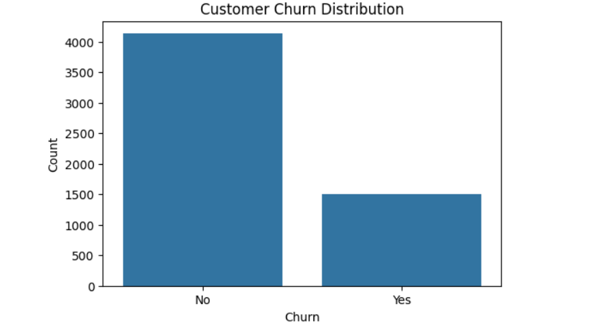
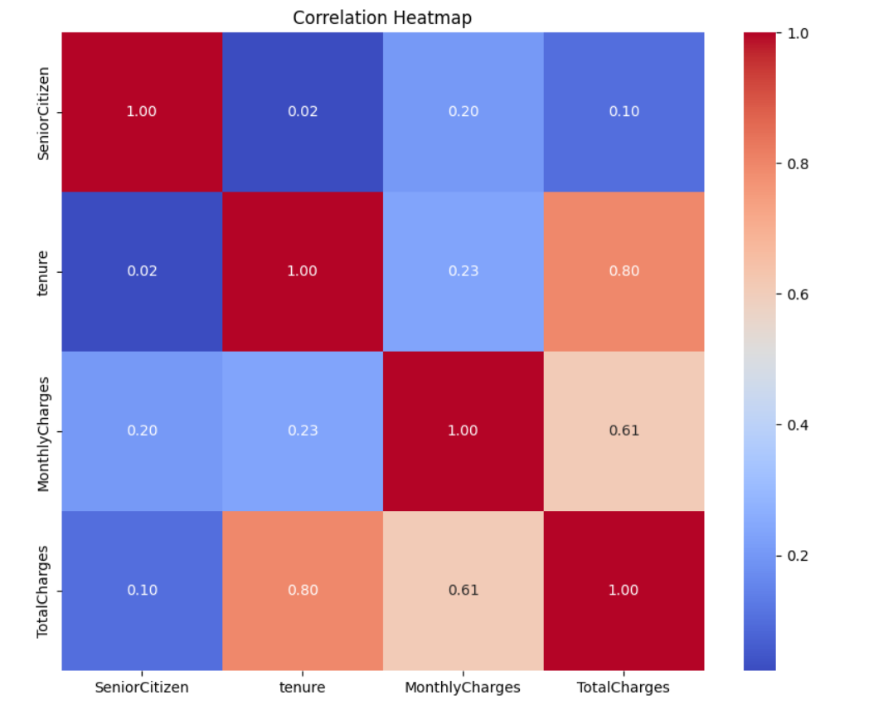
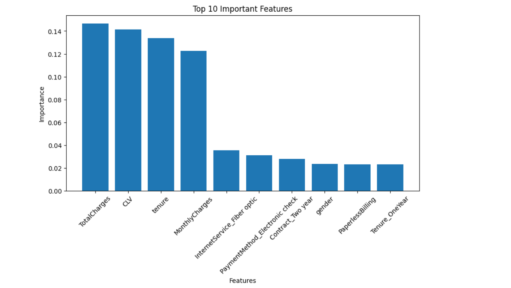
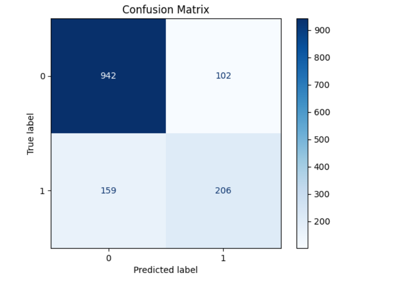
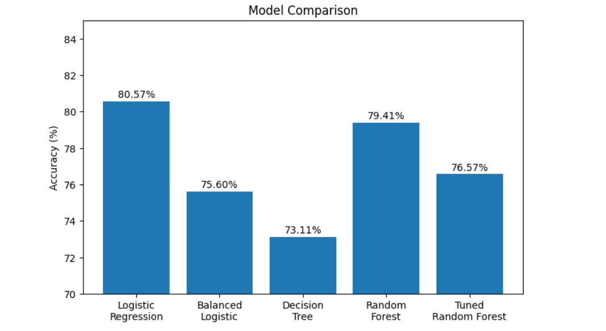

# 📊 Customer Churn Prediction using Machine Learning


---

## 📌 Project Overview

Customer churn prediction is a crucial task for subscription-based businesses to identify customers who are likely to discontinue their services. This project develops a Machine Learning model to predict customer churn using customer demographics, account information, and service usage data.

The project follows a complete Machine Learning workflow, including data preprocessing, exploratory data analysis (EDA), feature engineering, model training, hyperparameter tuning, model evaluation, and testing on an unseen dataset.

---

## 🎯 Problem Statement

The objective of this project is to build an accurate Machine Learning model capable of predicting customer churn, enabling businesses to take proactive customer retention measures and improve customer satisfaction.

---

## 📂 Dataset

The project uses two datasets:

- **Training_data.csv**
- **Testing_data.csv**

**Target Variable**

- **0 → Customer Stayed**
- **1 → Customer Churned**

---

## 🛠️ Technologies Used

- Python
- Pandas
- NumPy
- Matplotlib
- Seaborn
- Scikit-learn

---

## 📊 Exploratory Data Analysis (EDA)

The following analyses were performed:

- ✅ Dataset Inspection
- ✅ Missing Value Analysis
- ✅ Duplicate Record Detection
- ✅ Summary Statistics
- ✅ Target Variable Distribution
- ✅ Boxplots
- ✅ Histograms
- ✅ Correlation Heatmap
- ✅ Categorical Feature Analysis

---

## ⚙️ Feature Engineering

The following preprocessing techniques were applied:

- Missing Value Imputation
- Label Encoding
- Feature Scaling
- Customer Lifetime Value (CLV) Feature
- Interaction Features
- Feature Importance Analysis

---

## 🤖 Machine Learning Models

The following models were trained and evaluated:

- Logistic Regression
- Balanced Logistic Regression
- Decision Tree Classifier
- Random Forest Classifier
- Tuned Random Forest (GridSearchCV)

---

## 📈 Model Evaluation

The models were evaluated using:

- Accuracy
- Precision
- Recall
- F1-Score
- Confusion Matrix
- Classification Report

---

# 🏆 Best Model

| 🥇 Model | Test Accuracy |
|----------|--------------:|
| Logistic Regression | **81.48%** |

> **Selected Model:** Logistic Regression  
> **Final Test Accuracy:** **81.48%**

---

## 📊 Model Performance Comparison

| Model | Accuracy |
|--------|----------:|
| Logistic Regression | **80.57%** |
| Random Forest | 79.41% |
| Tuned Random Forest | 76.57% |
| Balanced Logistic Regression | 75.60% |
| Decision Tree | 73.11% |

---
## 📸 Project Visualizations

### Customer Churn Distribution



---

### Correlation Heatmap



---

### Feature Importance



---

### Confusion Matrix



---

### Model Comparison



## 📁 Project Structure

```text
Customer-Churn-Prediction/
│
├── Customer_Churn_Prediction.ipynb
├── Training_data.csv
├── Testing_data.csv
├── README.md
├── LICENSE
└── .gitignore
```

---

## 🚀 How to Run

### 1️⃣ Clone the repository

```bash
git clone https://github.com/akhil7102004-coder/Customer-Churn-Prediction.git
```

### 2️⃣ Install the required libraries

```bash
pip install pandas numpy matplotlib seaborn scikit-learn
```

### 3️⃣ Open the notebook

```
Customer_Churn_Prediction.ipynb
```

### 4️⃣ Run all cells

---

## 🔮 Future Improvements

- Deploy the model using Streamlit or Flask
- Perform Cross Validation
- Experiment with XGBoost and LightGBM
- Improve Feature Engineering
- Build an interactive dashboard for churn prediction

---

## 👨‍💻 Author

**Akhil A**

B.Tech Computer Science & Engineering

**Skills:** Python • SQL • Machine Learning • Data Analytics

GitHub: https://github.com/akhil7102004-coder

---

## 📄 License

This project is licensed under the **MIT License**.
